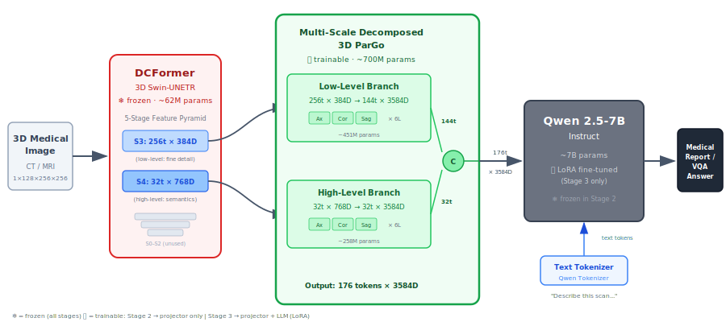
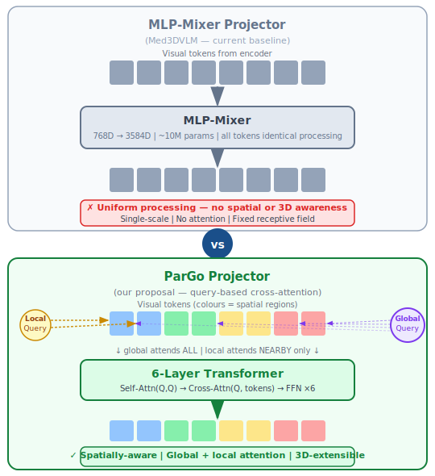
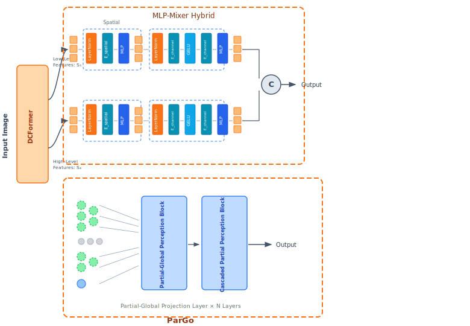
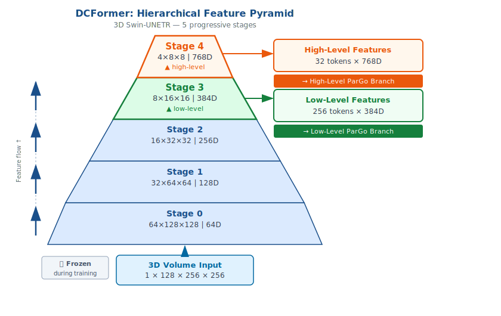
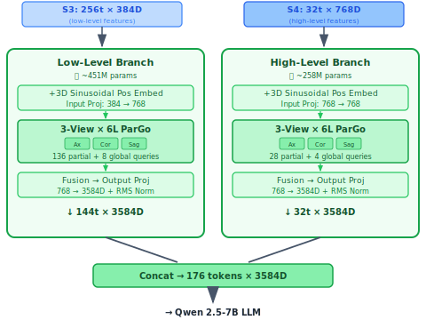
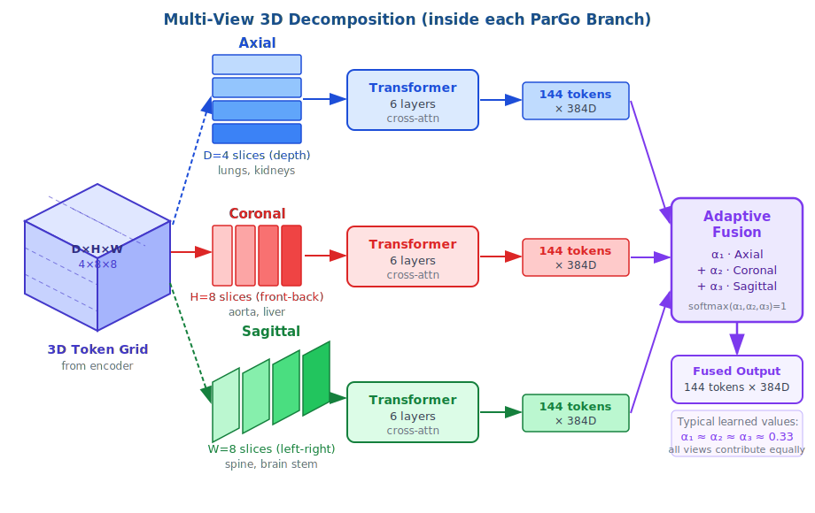
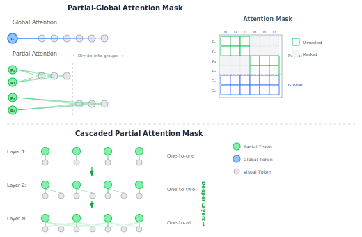

# Med3DPaLM: Multi-Scale Decomposed 3D ParGo for 3D Medical Vision-Language Models

**Dual Degree Project — Stage II**
**Aryan Mishra** | IIT Bombay | June 2026

> This project extends [Med3DVLM](https://arxiv.org/abs/2503.20047) by replacing its MLP-Mixer projector with a spatially-aware **Multi-Scale Decomposed 3D ParGo** projector, designed for bridging 3D volumetric visual features with a large language model while preserving spatial structure across anatomical planes.

<p align="center">
  
  <br>
  <em>Fig. 1 — End-to-end Med3DPaLM pipeline: 3D CT/MRI → DCFormer → Multi-Scale Decomposed 3D ParGo → Qwen 2.5-7B</em>
</p>

---

## Table of Contents

- [Overview](#overview)
- [Architecture](#architecture)
- [Repository Structure](#repository-structure)
- [Setup](#setup)
- [Data Preparation](#data-preparation)
- [Experiments](#experiments)
  - [Experiment 1: Baseline Reproduction](#experiment-1-baseline-reproduction)
  - [Experiment 2: Single-Scale ParGo](#experiment-2-single-scale-pargo)
  - [Experiment 3: Dual-Scale ParGo](#experiment-3-dual-scale-pargo)
- [Evaluation](#evaluation)
- [Demo](#demo)
- [Acknowledgements](#acknowledgements)

---

## Overview

3D medical VLMs face a fundamental bottleneck at the projector — the component that maps visual encoder outputs into the LLM's token space. Med3DVLM uses a dual-stream MLP-Mixer that treats visual tokens as flat vectors, discarding spatial relationships critical for volumetric imaging (CT/MRI).

<p align="center">
  
  <br>
  <em>Fig. 2 — Why ParGo? MLP-Mixer discards spatial structure; ParGo preserves it through partial-global attention.</em>
</p>

This project proposes **Multi-Scale Decomposed 3D ParGo** — a projector that:

1. **Preserves spatial structure** via partial-global attention masks (ParGo mechanism): partial queries attend to local subregions, global queries attend to all tokens, enabling both local detail capture and global context aggregation.
2. **Decomposes 3D volumes** across anatomical planes (axial, coronal, sagittal) with dedicated branches per plane and learned fusion weights.
3. **Processes multi-scale features** by tapping two DCFormer stages: low-level spatial features (Stage 3: 256 tokens × 384D) and high-level semantic features (Stage 4: 32 tokens × 768D).
4. **Uses cascaded partial perception (CPP)** — self-attention masks that progressively widen across layers, letting partial queries start with local context and gradually build global understanding.

### MLP-Mixer Hybrid vs ParGo Pipeline

<p align="center">
  
  <br>
  <em>Fig. 3 — Side-by-side comparison of the MLP-Mixer Hybrid projector (baseline) and the ParGo projector pipeline.</em>
</p>

---

## Architecture

### Component Summary

| Component | Architecture | Parameters | Status |
|-----------|-------------|-----------|--------|
| **Vision Encoder** | DCFormer (decomposed 3D conv + self-attention) | ~50M | Frozen (pretrained with SigLIP) |
| **Projector (Baseline)** | MLP-Mixer Hybrid (dual-stream) | ~47M | Trainable |
| **Projector (Ours)** | Multi-Scale Decomposed 3D ParGo | ~451M (low) + ~258M (high) | Trainable |
| **LLM** | Qwen 2.5-7B-Instruct | ~7.6B | LoRA fine-tuned (r=16, α=32) |

### DCFormer Feature Pyramid

The DCFormer encoder uses decomposed 3D convolutions to efficiently process volumetric inputs. Its 5-stage pyramid produces features at progressively lower spatial resolution and higher channel dimension:

<p align="center">
  
  <br>
  <em>Fig. 4 — DCFormer 5-stage feature pyramid. Stages S3 and S4 feed the dual-branch ParGo projector.</em>
</p>

| Stage | Channels | Spatial Size | Tokens | Used By |
|-------|----------|-------------|--------|---------|
| S0 | 64 | 32×64×64 | — | — |
| S1 | 96 | 16×32×32 | — | — |
| S2 | 192 | 8×16×16 | — | — |
| S3 | 384 | 4×8×8 | 256 | Low-level branch |
| S4 | 768 | 2×4×4 | 32 | High-level branch |

### Dual-Branch ParGo Projector

<p align="center">
  
  <br>
  <em>Fig. 5 — Dual-branch ParGo: independent low-level and high-level branches with 3-view decomposition, concatenated to 176 tokens.</em>
</p>

### Multi-View 3D Decomposition

<p align="center">
  
  <br>
  <em>Fig. 6 — 3D volume decomposition into axial, coronal, and sagittal planes, each processed by a dedicated ParGo branch with adaptive fusion.</em>
</p>

### ParGo Attention Mechanism

<p align="center">
  
  <br>
  <em>Fig. 7 — ParGo internal architecture: partial-global attention masks (top) and cascaded partial perception across layers (bottom).</em>
</p>

**Partial-Global Cross-Attention:**
- **Global queries** attend to all visual tokens — capturing holistic context.
- **Partial queries** attend to contiguous subsets of visual tokens — preserving spatial locality.

**Cascaded Partial Perception (CPP):**
- Layer 0: Each partial query sees only itself (one-to-one).
- Layer 1: Each partial query sees itself + *k* neighbors (one-to-few).
- Layer N: Visibility expands progressively (approaching one-to-all).

This cascading structure allows partial queries to gradually integrate broader context across layers while starting from a local receptive field.

---

## Repository Structure

```
.
├── src/
│   ├── model/
│   │   ├── encoder/
│   │   │   ├── dcformer.py           # DCFormer: decomposed 3D conv encoder
│   │   │   ├── vit.py                # ViT-3D alternative encoder
│   │   │   └── builder.py            # Vision tower factory
│   │   ├── projector/
│   │   │   ├── mlp.py                # MLP / MLP-Mixer projectors (baseline)
│   │   │   ├── single_scale_pargo.py # Exp 2: BERT-initialized ParGo (32 tokens)
│   │   │   ├── dual_scale_pargo.py   # Exp 3: Dual-branch ParGo (288 tokens)
│   │   │   ├── modified_pargo.py     # Multi-Scale Decomposed 3D ParGo (176 tokens)
│   │   │   ├── pargo.py              # Original ParGo projector (early prototype)
│   │   │   ├── mhsa.py               # Multi-head self-attention projector
│   │   │   ├── qformer_bert.py       # Q-Former BERT backbone
│   │   │   └── builder.py            # Projector factory (dispatches by type)
│   │   ├── llm/
│   │   │   ├── qwen.py               # VLMQwenForCausalLM (Qwen 2.5-7B wrapper)
│   │   │   └── __init__.py
│   │   ├── vlm_arch.py               # VLM meta-model: vision + projector + LLM wiring
│   │   └── CLIP.py                   # CLIP/SigLIP contrastive learning module
│   ├── train/
│   │   ├── train_baseline.py         # Exp 1: baseline training (MLP-Mixer)
│   │   ├── train_single_scale_pargo.py  # Exp 2: single-scale ParGo training
│   │   ├── train_dual_scale_pargo.py    # Exp 3: dual-scale ParGo training
│   │   ├── train_vlm.py              # Original Med3DVLM training script
│   │   ├── train_clip.py             # SigLIP contrastive pre-training
│   │   └── trainer.py                # Custom HuggingFace Trainer (MLLMTrainer)
│   ├── eval/
│   │   ├── eval_caption.py           # Image captioning evaluation (BLEU, METEOR, ROUGE, BERTScore)
│   │   ├── eval_caption_stage3.py    # Stage 3 captioning evaluation
│   │   ├── eval_vqa.py               # Open/closed-ended VQA evaluation
│   │   ├── eval_vqa_good_code.py     # Cleaned VQA eval with proper metrics
│   │   ├── eval_clip.py              # Image-text retrieval evaluation
│   │   ├── merge_lora_and_save_exp2.py  # Merge LoRA + save complete model (Exp 2)
│   │   ├── merge_lora_and_save_exp3.py  # Merge LoRA + save complete model (Exp 3)
│   │   └── save_complete_model*.py   # Utilities for model weight consolidation
│   ├── dataset/
│   │   ├── mllm_dataset.py           # CapDataset, VQADataset, TextDatasets, TextYNDatasets
│   │   ├── clip_dataset.py           # Dataset for contrastive pre-training
│   │   └── prompt_templates.py       # Caption/VQA prompt templates
│   └── utils/
│       ├── m3d_cap_data_prepare_128.py  # Prepare M3D-Cap data in 128×256×256 NIfTI
│       ├── merge_lora_weights_and_save_hf_model.py  # LoRA weight merging utility
│       └── rename_csv.py             # Fix dataset CSV paths after preparation
├── scripts/
│   ├── experiment1/                  # Baseline reproduction scripts
│   │   ├── exp1_stage2_pretrain.sh   # Stage 2: projector pretraining (MLP-Mixer)
│   │   ├── run_gpu_script.sh         # SLURM job submission wrapper
│   │   ├── eval_vqa_expt1.sh         # VQA evaluation
│   │   ├── exp1_eval_caption.sh      # Captioning evaluation
│   │   └── ds_zero2.json             # DeepSpeed ZeRO-2 config
│   ├── experiment2/                  # Single-scale ParGo scripts
│   │   ├── exp2_single_scale_pargo.sh         # Stage 2: ParGo pretraining
│   │   ├── exp2_single_scale_pargo_stage3.sh  # Stage 3: LoRA fine-tuning
│   │   ├── eval_vqa_expt2.sh         # VQA evaluation
│   │   ├── exp2_eval_caption.sh      # Captioning evaluation
│   │   └── ds_zero2.json             # DeepSpeed ZeRO-2 config
│   ├── experiment3/                  # Dual-scale ParGo scripts
│   │   ├── exp3_dual_scale_pargo.sh           # Stage 2: dual ParGo pretraining
│   │   ├── exp3_dual_scale_pargo_stage3.sh    # Stage 3: LoRA fine-tuning
│   │   ├── eval_vqa_expt3.sh         # VQA evaluation
│   │   ├── exp3_eval_caption.sh      # Captioning evaluation
│   │   └── ds_zero2.json             # DeepSpeed ZeRO-2 config
│   ├── eval/                         # Shared evaluation scripts
│   │   ├── eval_caption.sh
│   │   ├── eval_vqa.sh
│   │   ├── eval_clip.sh
│   │   └── overall.sh
│   └── legacy_scripts/               # Archived early-stage scripts
├── test_logs/                        # Evaluation output logs per experiment
├── docs/
│   ├── pipeline.png                  # Original Med3DVLM architecture diagram
│   ├── D1_mlp_vs_pargo.svg           # MLP-Mixer vs ParGo motivation
│   ├── D6_full_pipeline.svg          # Full Med3DPaLM end-to-end pipeline
│   ├── D7_dcformer_pyramid.svg       # DCFormer 5-stage feature pyramid
│   ├── D8_dual_branch_pargo.svg      # Dual-branch ParGo architecture
│   ├── D9_multiview_decomposition.svg # Multi-view 3D decomposition
│   ├── D10_mlp_vs_pargo_pipeline.svg  # MLP-Mixer vs ParGo pipeline comparison
│   └── D11_pargo_internal_attention.svg # ParGo attention masks & cascaded perception
├── app.py                            # Gradio web demo
├── requirements.txt                  # Python dependencies
├── env.yaml                          # Conda environment specification
└── LICENSE                           # MIT License
```

---

## Setup

### Prerequisites

- Python 3.12+
- CUDA 12.4+ with NVIDIA A100 GPUs (1–3 GPUs depending on experiment)
- ~80 GB disk for datasets, ~30 GB for model weights

### Installation

```bash
git clone https://github.com/asy62636/Med3DPaLM_DDP2_Aryan_Mishra.git
cd Med3DPaLM_DDP2_Aryan_Mishra
```

**Option A — Conda (recommended):**
```bash
conda env create -f env.yaml
conda activate Med3DVLM
```

**Option B — pip:**
```bash
pip install -r requirements.txt
```

Set the Python path:
```bash
export PYTHONPATH=$(pwd):$PYTHONPATH
```

### Required Model Weights

| Model | Source | Notes |
|-------|--------|-------|
| DCFormer + SigLIP | [HuggingFace](https://huggingface.co/MagicXin/DCFormer_SigLIP) | Pretrained vision encoder; place in `output2/DCFormer_SigLIP/` |
| Qwen 2.5-7B-Instruct | [HuggingFace](https://huggingface.co/Qwen/Qwen2.5-7B-Instruct) | Auto-downloaded by HuggingFace Transformers |

---

## Data Preparation

This project trains and evaluates on the **M3D** benchmark:

| Dataset | Type | Images | Texts | Link |
|---------|------|--------|-------|------|
| M3D-Cap | 3D image-text pairs | 120,092 | 42,496 | [HuggingFace](https://huggingface.co/datasets/GoodBaiBai88/M3D-Cap) |
| M3D-VQA | 3D VQA (open + closed) | 96,170 | 509,755 | [HuggingFace](https://huggingface.co/datasets/GoodBaiBai88/M3D-VQA) |

**Step 1.** Download datasets into `data/`:
```bash
mkdir -p data
# Download M3D-Cap and M3D-VQA from HuggingFace into data/
```

**Step 2.** Convert to 128×256×256 NIfTI:
```bash
python src/utils/m3d_cap_data_prepare_128.py
```

**Step 3.** Fix CSV paths:
```bash
python src/utils/rename_csv.py --csv_path data/M3D-VQA/M3D_VQA_train.csv
python src/utils/rename_csv.py --csv_path data/M3D-VQA/M3D_VQA_test.csv
python src/utils/rename_csv.py --csv_path data/M3D-VQA/M3D_VQA_val.csv
```

Expected directory structure after preparation:
```
data/
├── M3D-Cap/
├── M3D_Cap_npy/         # Processed caption data
│   └── M3D_Cap.json
└── M3D-VQA/
    ├── M3D_VQA_train.csv
    ├── M3D_VQA_val.csv
    └── M3D_VQA_test.csv
```

---

## Experiments

All experiments follow a two-stage training protocol:

| Stage | What trains | What's frozen | Goal |
|-------|------------|--------------|------|
| **Stage 2** — Projector Pretraining | Projector + embed_tokens | DCFormer + LLM | Align visual features with LLM input space |
| **Stage 3** — LoRA Fine-tuning | Projector + LoRA adapters + embed_tokens | DCFormer | Teach the model to generate reports and answer questions |

### Experiment 1: Baseline Reproduction

Reproduces the original Med3DVLM result using the **MLP-Mixer Hybrid** projector.

| Setting | Value |
|---------|-------|
| Projector | `mixer` (dual-stream MLP-Mixer-H) |
| Output tokens | 288 (256 low + 32 high) |
| Projector params | ~47M |
| `vision_select_layer` | -2 (penultimate + final) |
| Batch size | 16 effective (8 × 2 grad accum) |
| GPUs | 1× A100 |

```bash
# Stage 2
bash scripts/experiment1/exp1_stage2_pretrain.sh

# Stage 3 (after saving complete model from Stage 2)
bash scripts/experiment1/run_gpu_script.sh
```

### Experiment 2: Single-Scale ParGo

Replaces MLP-Mixer with a **BERT-initialized single-scale ParGo** operating on DCFormer's final layer only.

| Setting | Value |
|---------|-------|
| Projector | `single_scale_pargo` |
| Output tokens | 32 (8 global + 24 partial) |
| Projector params | ~20M |
| BERT layers | 2 (pretrained initialization) |
| `vision_select_layer` | -1 (final layer only) |
| Batch size | 24 effective (4 × 2 × 3 GPUs) |
| GPUs | 3× A100 |

```bash
# Stage 2
bash scripts/experiment2/exp2_single_scale_pargo.sh

# Merge LoRA weights
python src/eval/merge_lora_and_save_exp2.py

# Stage 3
bash scripts/experiment2/exp2_single_scale_pargo_stage3.sh
```

### Experiment 3: Dual-Scale ParGo

Uses **two independent ParGo branches** — one for low-level features (Stage 3) and one for high-level features (Stage 4), matching Med3DVLM's 288-token count.

| Setting | Value |
|---------|-------|
| Projector | `dual_scale_pargo` |
| Low branch | 256 queries (200 partial + 56 global) from S3 (256t×384D) |
| High branch | 32 queries (24 partial + 8 global) from S4 (32t×768D) |
| Output tokens | 288 (256 + 32) |
| Projector params | ~80M (two BERT instances + output projections) |
| BERT layers | 2 per branch (pretrained initialization) |
| `vision_select_layer` | -2 (both layers) |
| Batch size | 18 effective (2 × 3 × 3 GPUs) |
| GPUs | 3× A100 |

```bash
# Stage 2
bash scripts/experiment3/exp3_dual_scale_pargo.sh

# Merge LoRA weights
python src/eval/merge_lora_and_save_exp3.py

# Stage 3
bash scripts/experiment3/exp3_dual_scale_pargo_stage3.sh
```

---

## Evaluation

### Image Captioning (M3D-Cap)

Evaluates generated radiology reports against ground-truth using BLEU-1, METEOR, ROUGE-L, and BERTScore.

```bash
# Experiment 1
bash scripts/experiment1/exp1_eval_caption.sh

# Experiment 2
bash scripts/experiment2/exp2_eval_caption.sh

# Experiment 3
bash scripts/experiment3/exp3_eval_caption.sh
```

### Visual Question Answering (M3D-VQA)

**Open-ended VQA** — Free-form answers evaluated with BLEU-1, METEOR, ROUGE-L (per category: Modality, Organ, Abnormality, etc.).

**Closed-ended VQA** — Yes/No accuracy.

```bash
# Experiment 1
bash scripts/experiment1/eval_vqa_expt1.sh

# Experiment 2
bash scripts/experiment2/eval_vqa_expt2.sh

# Experiment 3
bash scripts/experiment3/eval_vqa_expt3.sh
```

Evaluation logs are saved to `test_logs/`.

### Image-Text Retrieval

```bash
bash scripts/eval/eval_clip.sh
```

---

## Demo

### Terminal
```bash
python src/demo/demo.py \
    --model_name_or_path path/to/saved/model \
    --image_path path/to/ct_scan.nii.gz \
    --question "Describe the findings of the medical image you see."
```

### Web Interface (Gradio)
```bash
python app.py
```

Launches a Gradio interface for interactive inference — upload a 3D NIfTI volume and ask questions about it.

---

## Key Implementation Details

### Projector Types (via `--mm_projector_type`)

| Type | Class | Tokens | Layers | Description |
|------|-------|--------|--------|-------------|
| `mixer` | `MixerLowHighHybridMLP` | 288 | — | Original Med3DVLM MLP-Mixer (baseline) |
| `single_scale_pargo` | `SingleScaleParGo` | 32 | 2 BERT | ParGo on final DCFormer layer only |
| `dual_scale_pargo` | `DualScaleParGo` | 288 | 2 BERT × 2 branches | ParGo on both penultimate + final layers |
| `modified_pargo` | `MultiScaleDecomposed3DParGo` | 176 | 6 per scale | Full 3D decomposed ParGo with 3-view fusion |
| `mlp` | `MultiModalProjector` | 32 | 2 MLP | Simple MLP projector |
| `pargo` | `ParGoProjector` | configurable | Q-Former | Original Q-Former-based ParGo |

### Training Configuration

All experiments use:
- **Optimizer:** AdamW (weight decay = 0)
- **LR schedule:** Cosine with 3% warmup
- **Precision:** bfloat16
- **Framework:** DeepSpeed ZeRO-2
- **Sequence length:** 512 (Exp 1) / 2048 (Exp 2, 3)

### Data Augmentation (Training)

Applied via MONAI transforms on 3D volumes:
- Random 90° rotation (prob=0.5, axes 1-2)
- Random flip (prob=0.1 per axis)
- Random intensity scaling (±10%, prob=0.5)
- Random intensity shift (±0.1, prob=0.5)

---

## Acknowledgements

This project builds upon:

- **[Med3DVLM](https://github.com/mirthAI/Med3DVLM)** — Base architecture (DCFormer + MLP-Mixer + Qwen). Yu Xin, Gorkem Can Ates, Kuang Gong, Wei Shao. [arXiv:2503.20047](https://arxiv.org/abs/2503.20047)
- **[DCFormer](https://arxiv.org/abs/2502.05091)** — Decomposed convolution encoder. Gorkem Can Ates, Kuang Gong, Wei Shao.
- **[ParGo](https://arxiv.org/abs/2408.12637)** — Partial-global attention mechanism for VLMs. (Adapted from 2D to 3D decomposed multi-scale variant in this work.)
- **[M3D](https://github.com/BAAI-DCAI/M3D)** — 3D medical multimodal dataset and benchmark.
- **[Qwen 2.5](https://huggingface.co/Qwen/Qwen2.5-7B-Instruct)** — Large language model backbone.

## License

MIT License — see [LICENSE](LICENSE) for details.

## Citation

```bibtex
@misc{mishra2026med3dpalm,
  title={Med3DPaLM: Multi-Scale Decomposed 3D ParGo for 3D Medical Vision-Language Models},
  author={Mishra, Aryan},
  year={2026},
  note={Dual Degree Project — Stage II, IIT Bombay}
}
```
